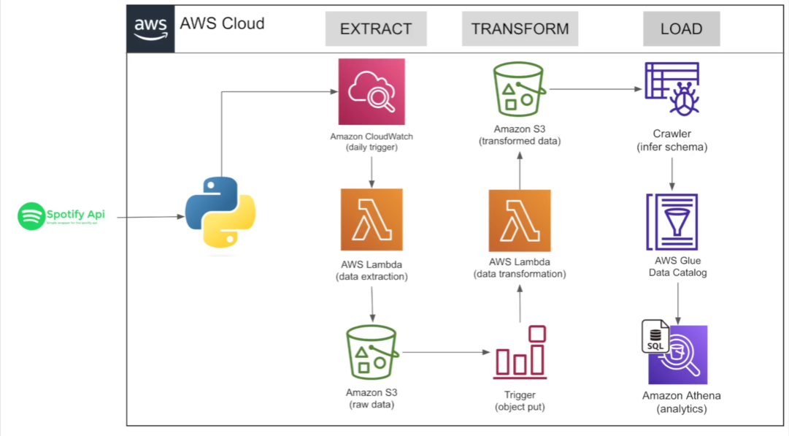

# Spotify-End-To-End Data Engineering Project

### Introduction
This project demonstrates an end-to-end ETL pipeline built on AWS using data from the Spotify API. It covers data ingestion, transformation, and loading into an AWS data store, following best practices in data engineering and cloud architecture.

### Architecture
 

 ### About Dataset/API
 This API contains information abaout music, artist, album and songs - [Spotfy API](https://developer.spotify.com/documentation/web-api)

### Services Used
1. **Amazon S3 (Simple Storage Service):** Amazon S3 is a highly scalable and durable object storage service designed to store and retrieve any amount of data from anywhere. It is widely used for data backups, data lakes, large media file storage, and hosting static websites, making it a core component in modern data and cloud architectures.

2. **AWS Lambda:** Is a sleeveless computing service that lets you run your code without managing servers. You can use Lambda to run code in response to events like changes in S3, DynamoDB or other AWS services

3. **Cloud Watch:** Amazon CloudsWatch is a monitoring service for AWS resources and the applications you run on them. You can use CloudsWatch to collect and track metrics, collect and monitor log files and set alarms

4. **AWS Glue Crawler:** Automatically scans data sources, infers schemas, and creates or updates tables in the AWS Glue Data Catalog.

5. **AWS Glue Data Catalog:** A centralized metadata repository that stores table definitions, schemas, and data locations, enabling seamless data discovery and query integration across AWS analytics services.

6. **Amazon Athena:**A serverless interactive query service that allows you to analyze data directly in Amazon S3 using standard SQL, without managing any infrastructure.

### Install packages 
```bash
pip install pandas
pip install numpy
pip install spotipy

```

## 🚀 Project Execution Flow

1. 🔗 **Data Extraction**  
   Data is extracted from an external API.

2. ⏱️ **AWS Lambda Trigger**  
   An AWS Lambda function is triggered every **1 hour** to start the pipeline.

3. 🗄️ **Raw Data Storage (Amazon S3)**  
   The extracted raw data is stored in Amazon S3.

4. ⚙️ **Data Transformation**  
   A downstream Lambda function is triggered to transform the raw data into an analytics-ready format.

5. 📦 **Data Loading**  
   The transformed data is loaded back into Amazon S3.

6. 🔍 **Data Querying (Amazon Athena)**  
   Amazon Athena is used to query and analyze the processed data using SQL.


